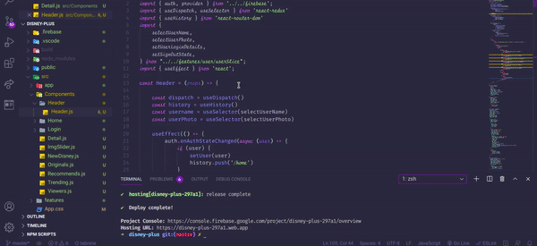

<h1 align='center'>Disney+ Clone</h1>

<p align='center'></p>

A Disney+ Clone made by using **React** + **Styled-Components** + **Redux** + **Firebase**.

### Setting Up in Local Environment

1. Clone this repository - ```git clone https://github.com/pranjals149/Disney-Plus-Clone.git```
2. Move into the project repository - ```cd Disney-Plus-Clone```
3. Create a firebase project and copy your project configurations' settings with the contents of the file **firebase.js** inside **src** folder.
4. Now, install the required dependencies - ```npm install```
5. Now, run the project on localhost - ```npm start```

*The project will be started in local development mode on http://localhost:3000/*

### Working Screenshot


*Hope you like the project !!*